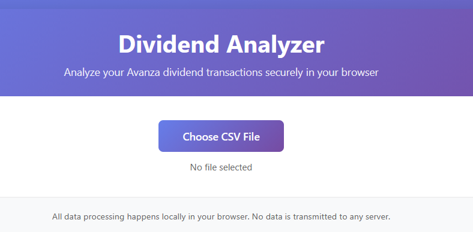

# Dividend Model

A web-based dividend calculator for analyzing and visualizing dividend income using an exported .csv file from Avanza. 

> [!WARNING]
> Note that the model only works for the Avanza .csv exports.

## Features

- **Upload transaction data**: Import your dividend transactions csv file
- **Interactive Vvisualization**: View dividend income trends over time with interactive charts
- **Detailed Analysis**: See breakdowns by stock, year, and account
- **Tax Calculations**: Automatic calculation of Swedish and foreign taxes
- **Privacy-First**: All processing happens locally in your browser - no data is sent to any server

## Usage

1. Open `index.html` in a modern web browser
2. Click "Choose File" to upload your dividend transaction CSV file
3. View your dividend analysis and interactive charts

## CSV Format

The calculator expects a CSV file with the following columns:
- Date (YYYY-MM-DD)
- Stock/Security name
- Amount
- Currency
- Account (optional)
- Tax information (optional)

## Technology

Built with:
- Pure JavaScript (no frameworks required)
- Chart.js for visualizations
- Client-side CSV parsing

## Privacy & Security

**Important**: This tool processes all data locally in your web browser. No financial data is transmitted to any server or stored anywhere except your local computer.

## License

MIT License - Feel free to use and modify for your own purposes.

## Contributing

Contributions are welcome! Please feel free to submit issues or pull requests. I will reserve the right not to accept them though 😉
